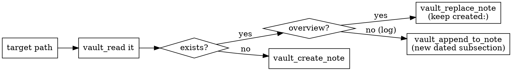

# brain-project-note

## Overview

Capture the project you're working in — and what you did this session — as
notes in the user's "brain" vault, written **only** through the brain MCP
server. You are usually invoked from *another* repo, not the brain itself.

**Core principle:** the brain's location is the MCP server's concern. You call
tools with vault-relative paths (`knowledge/projects/...`); you never read,
guess, or hardcode where the brain lives on disk.

## Hard requirement: MCP-only

If the `mcp__brain__*` tools are NOT available this session, STOP. Do not write
files anywhere as a fallback. Tell the user:

> The brain MCP server isn't connected. Start it (`mcp_server/run-local.sh` in
> the brain repo) and register it (`claude mcp add --transport http --scope
> user brain http://127.0.0.1:8765/mcp --header "Authorization: Bearer
> $(cat ~/.brain-mcp-token)"`), then reconnect (`/mcp`) and re-run me.

## Layout (exact — do not flatten)

```
knowledge/projects/<slug>/
├── <slug>.md          # overview — you own this, full-rewrite each run
├── <topic>.md         # focused curated notes — create these when warranted
├── notes/             # the human's own notes — NEVER write here
└── log/<YYYY-MM-DD>.md # one session-update note per day — you create/append

knowledge/projects/shared/
└── <topic>.md         # notes spanning several projects, related_to each
```

A project is more than its overview and log. Beyond `<slug>.md` and
`log/<date>.md`, you MAY (and should, when it earns its place) create **focused
curated notes** — a durable decision, a design, a transcribed artefact, a
sub-topic — flat under `knowledge/projects/<slug>/` with a descriptive
kebab-case filename (e.g. `mnemosyne-capabilities.md`), distinct from the
`<slug>.md` overview. A note that spans several projects goes under
`knowledge/projects/shared/`, linked to each project with a `related_to`
relation. Give curated notes `topics:` and `relations:` frontmatter so they
join the concept and relation graph. This is additive — the overview + log
remain the session-snapshot baseline; curated notes are for knowledge that
deserves its own home rather than a log line. The `notes/` subdir stays the
human's area — never write there.

- `<slug>` = the project's **git remote name**: take `git remote get-url origin`,
  drop a trailing `.git`, keep the last path segment, lowercase,
  non-alphanumerics → `-` (e.g. `git@github.com:acme/RandEval.git` → `randeval`).
  The directory name is NOT the identity — the same repo checked out under
  `fyp-old/`, `comp0138-vpjx1/`, and `randeval/` is ONE project and must map
  to ONE folder. Only when there is no git remote, fall back to the repo-root
  basename (`git rev-parse --show-toplevel`), then the cwd basename.
- Do **not** create a `knowledge/index/...` MOC. Do **not** touch `notes/`.

## Identity check (before any write)

If `knowledge/projects/<slug>/` already exists → proceed (same project).
If it does NOT exist, check you're not about to fragment an existing project:
`vault_list knowledge/projects`, and for each existing folder
`vault_read knowledge/projects/<f>/<f>.md` and compare its `source_repo`
against this project's identity:

- **With a remote**: compare remote URLs normalized — scheme/`git@` form,
  trailing `.git`, and case don't matter.
- **No remote**: compare this repo's absolute root path against any
  local-path `source_repo` values; also treat an existing overview whose
  *title or topics* clearly describe the same work as a candidate match
  (a local copy under a new dir name produces exactly this situation).

On a match — or when you're unsure — STOP and ask the user whether to write
into the existing folder or really create a new one. Never silently create
a second folder for a project that already appears in the vault.

`source_repo` must be machine-comparable: write EXACTLY the remote URL, or
the absolute local path when there is no remote. No annotations or prose —
`"/Users/x/proj (local, not a git repo)"` breaks every future comparison.

## Procedure

1. **Get the real UTC timestamp** for frontmatter + the log filename:
   `date -u +%Y-%m-%dT%H:%M:%SZ` (date part = the `log/<YYYY-MM-DD>.md` name).
2. **Gather — project overview** (ground every claim in real facts; never
   invent, mark unknowns as `TODO`, exclude secrets/tokens/internal URLs):
   README, `git remote -v`, `git log --oneline -20`, current branch,
   top-level structure, stack (manifest files like `package.json`/`pyproject.toml`).
3. **Gather — this session**: what you actually did in this conversation
   (changes, decisions, problems solved) plus `git diff`/new commits since the
   session began.
4. **Write the overview** `knowledge/projects/<slug>/<slug>.md`:
   - `vault_read` it. **Not found** → `vault_create_note` with a fresh
     `created:`. **Found** → parse its `created:`, keep it verbatim, regenerate
     the full body, bump `updated:`, then `vault_replace_note`.
5. **Write the session log** `knowledge/projects/<slug>/log/<YYYY-MM-DD>.md`:
   - `vault_read` it. **Not found** → `vault_create_note`. **Found**
     (same-day rerun) → `vault_append_to_note` a new `## <HH:MM>Z` subsection.
6. **Report** the `commit_sha` from each `WriteResult`. If `committed` is
   false, surface the `warning` — don't claim success. No manual reindex:
   the MCP server re-embeds every write in the background (debounced a
   couple of seconds), so the notes are searchable within seconds; a write
   that changes `topics`/`relations` also rebuilds concept links and
   dashboards automatically. The `index_refresh` field on each
   `WriteResult` (`queued`/`off`/`skipped`) reports where that stands.

## Write-tool decision



Never use `vault_append_to_note` on the overview — that turns it into a
changelog. The overview is always a full, current rewrite.

## Note templates

**Overview** `<slug>.md`:

```markdown
---
title: "<Project name>"
type: project
status: active
source_repo: "<exact remote URL, or absolute local path if no remote — nothing else>"
created: "<ISO8601 UTC — set once, preserved across rewrites>"
updated: "<ISO8601 UTC — bumped each run>"
topics: []
aliases: []
---

# <Project name>

## Overview
<1–2 sentences: what it is and its goal.>

## Stack
<languages, frameworks, datastore, infra — real, from manifests.>

## Architecture
<entry points, main modules/dirs, API surface.>

## Current state
<active branch, where things stand, what's in flight.>

## Links
- Repo: <remote URL or path>
- Session log: see `log/` in this folder
- Curated notes: `<topic>.md` files beside this overview (and `projects/shared/`)
- Notes: see `notes/` in this folder (the human's area)
```

**Session log** `log/<YYYY-MM-DD>.md`:

```markdown
---
title: "<Project name> — session <YYYY-MM-DD>"
type: project
created: "<ISO8601 UTC>"
updated: "<ISO8601 UTC>"
project: "[[knowledge/projects/<slug>/<slug>]]"
topics: []
---

# <Project name> — session <YYYY-MM-DD>

## What was done
<concrete changes and outcomes from this session.>

## Decisions
<key choices and why.>

## Next
<open items / next steps.>

## Links
- Project: [[knowledge/projects/<slug>/<slug>]]
- Commits: <relevant SHAs / branch>
```

## Common mistakes

| Mistake | Do instead |
|---|---|
| Slugging the directory name | Slug the git remote; dirs `fyp-old/` and `randeval/` with one remote are ONE project |
| Creating a new folder without the identity check | Compare the remote against existing notes' `source_repo` first; ask on a match |
| Flattening the whole project to `projects/<slug>.md` | The *overview* is `projects/<slug>/<slug>.md` inside the folder (curated `<topic>.md` notes beside it are fine) |
| Cramming every artefact into the log | Give a durable decision / design / artefact its own curated `<topic>.md` under `projects/<slug>/` (or `projects/shared/`) |
| Appending updates to the overview | Overview is a full rewrite via `vault_replace_note` |
| Resetting `created:` on a rewrite | Read the old note first; preserve `created:` |
| Hardcoding "today" | Real `date -u`; timestamps only in frontmatter + log filename |
| Creating a `knowledge/index/` MOC | Don't; the vault generates index notes elsewhere |
| Writing into `notes/` | That's the human area — never write there |
| Inventing facts to fill the template | Ground in the repo; mark unknowns `TODO`; no secrets |
| Falling back to direct file writes | MCP-only — if tools absent, stop and give setup steps |
